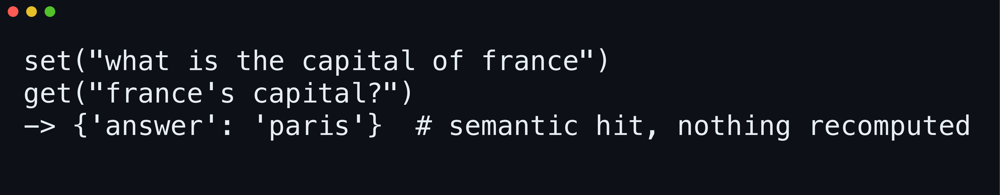

# 

**Stop paying for answers you already have.** semisweet memoizes expensive async functions behind one decorator; its Rust core matches by embedding similarity, so paraphrased calls hit the cache offline.

[](https://github.com/yasyf/semisweet/actions/workflows/ci.yml)
[](LICENSE)

## Get started

```bash
git clone https://github.com/yasyf/semisweet
cd semisweet
uv venv && uvx maturin develop --uv
```

```python
import asyncio
import semisweet

async def main():
    cache = semisweet.SemanticCache(namespace="capitals")  # offline by default — no API keys
    await cache.set(semisweet.CacheQuery(query="what is the capital of france"), {"answer": "paris"})
    print(await cache.get(semisweet.CacheQuery(query="france's capital?")))

asyncio.run(main())
```



Driving with an agent? Paste this:

```text
Clone https://github.com/yasyf/semisweet, cd in, and run: uv venv && uvx maturin develop --uv
Wrap my most expensive async function in @semisweet.cache so reworded inputs return the cached result instead of re-running the body.
Prove it: call the function twice with paraphrased queries and show the second call skips the body.
```

---

## Use cases

### Skip the LLM call when the question is just a rewording

Your users ask the same question a dozen different ways, and an exact-match cache treats every rewording as a fresh miss — so you pay the model each time. Put the cache in front of the call:

```python
@semisweet.cache
async def answer(question: str) -> dict:
    return await call_model(question)  # the expensive part

# one request:
await answer("what is the capital of france")  # miss — runs the model
# a later request:
await answer("france's capital?")              # semantic hit — the body never runs
```

The reworded call returns the stored dict from process memory: the Rust core embeds the query, and the cosine clears the precision-first threshold.

### Memoize an expensive async function with one decorator

`functools.cache` won't await and keys on exact arguments; hand-rolled memoization grows a Redis instance and a serialization layer. `@semisweet.cache` keys a semantic cache on the function's `module:qualname` — the sole `str`-annotated parameter becomes the query, or name it with `query=` when there's more than one:

```python
@semisweet.cache(query="question", keys=("model",))
async def answer(question: str, model: str) -> Answer: ...
```

Entries scope per exact `model` string via `keys`, tie-breaking steers with `context=`, and values come back as the objects you stored — no serialization layer to write.

### Start fully offline with zero API keys, then grow recall onto turbopuffer and S3

Most semantic caches want an embeddings key and a vector-store account before you cache byte one. A bare namespace runs on local BGE embeddings, keyword entities, an in-process index, and on-disk payloads — no keys, no network. When recall has to outlive a process or outgrow RAM, swap one keyword argument per axis:

```python
cache = semisweet.SemanticCache(
    namespace="prod",
    vectors=semisweet.TurbopufferVectors(),
    storage=semisweet.S3Storage(bucket="answers"),
)
```

The hot path stays in process memory; [turbopuffer](https://turbopuffer.com) holds the durable index and S3 the payloads, so the index stays lean.

## Backends

Swap any axis by passing a backend object — all keyword-only, every argument optional:

| Axis | Builtins |
|------|----------|
| Embedding | `LocalEmbedding(model=...)` — BGE-small on CPU; `VoyageEmbedding(model=..., dim=...)` — Voyage HTTP API |
| Entities | `KeywordEntities(lang=...)` — YAKE keywords; `GlinerEntities(labels=..., repo=...)` — GLiNER spans (`--features gliner`) |
| Vector index | `MemoryVectors()` — in-process; `TurbopufferVectors()` — turbopuffer |
| Object store | `DiskStorage(root=...)` — local filesystem; `S3Storage(bucket=..., region=..., endpoint=..., prefix=...)` — S3-compatible |

Local models auto-download from the Hugging Face Hub on first use and run offline after, cached under `SEMISWEET_MODEL_CACHE`. Remote backends read credentials from the environment:

| Variable | Read by |
|----------|---------|
| `VOYAGE_API_KEY` | `VoyageEmbedding` |
| `TURBOPUFFER_API_KEY` | `TurbopufferVectors` |
| `AWS_ACCESS_KEY_ID`, `AWS_SECRET_ACCESS_KEY`, `AWS_REGION`, `S3_ENDPOINT`, `SEMISWEET_S3_BUCKET` | `S3Storage` |

The default build ships Voyage, turbopuffer, and S3 in a single abi3 wheel for Python 3.9+; add GLiNER entities with `--features gliner`.

## API notes

- `CacheQuery(query=..., keys=..., context=...)` is keyword-only. `keys` is an optional contains-all filter; `context` is optional fallback text for entity extraction and tie-breaking.
- `SemanticCache` stores and returns whole Python objects. A [Pydantic](https://docs.pydantic.dev) model round-trips to its exact class when the `pydantic` extra is installed; anything else falls back to `pickle`. The raw, bytes-in bytes-out cache lives at `semisweet.core.SemanticCache` when you want to own serialization yourself.
- `get` returns the stored object, or the `MISS` sentinel on a miss — so `None` is a value you can cache.
- Constructing a cache is synchronous and does no I/O; the first `await` transparently spawns and connects a shared per-user daemon that holds the models and index, so only the first call pays the load cost. It idle-shuts-down on its own; when you do need to stop it by hand, `await semisweet.shutdown_daemon()` returns whether one was running.
- `set` is read-after-write: a `get` for the same query is served immediately from an in-memory shadow. Recall for *reworded* queries lands once the background write drains to the index — moments later, not in the same breath.
- Tune acceptance with `Scoring(threshold=..., top_k=..., entity_filter=..., context=..., context_gate=..., context_threshold=...)`. The defaults are calibrated precision-first (cosine threshold 0.92).

## Architecture

The core is Rust, exposed to Python through pyo3 as `semisweet.core`, with the async object cache and decorator layered on top in pure Python. Every process talks over a length-framed Unix-socket protocol to a lazily-spawned per-user daemon that holds the embedding model, the entity extractor, and the hot index in memory — so a hit costs a socket round trip, not a model load. Writes flow through a write-behind queue backed by the read-after-write shadow, and payloads are zstd-compressed before they reach the object store.

Status: pre-release — no published wheel yet; install from source as above.

Licensed under [PolyForm Noncommercial 1.0.0](LICENSE).
